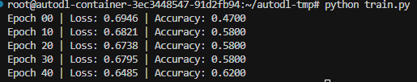

\# Temporal Graph Attention Network (TGAT) Implementation

\## 项目概述

本项目实现了一个基于时间的图注意力网络（TGAT），用于处理带有时间信息的图数据。TGAT 模型通过在图卷积过程中引入时间编码，能够更好地捕捉图结构和时间信息，适用于处理具有动态变化的图数据，如欺诈检测等场景。

\## 项目结构

\- `tgat.py`: 定义了 TGAT 模型的核心组件，包括时间编码层、时间图注意力卷积层和整个 TGAT 模型。

\- `train.py`: 用于训练 TGAT 模型，包括数据加载、模型初始化、优化器设置和训练循环。

\- `dataset\_builder.py`: 构建合成图数据，包括节点特征、边连接、边上的时间戳和节点标签。


\## 依赖安装

```bash

pip install torch torch\_geometric

```


\## 代码使用


\### 模型训练

运行 `train.py` 可以开始训练 TGAT 模型。训练过程中，模型会在每 10 个 epoch 输出一次损失和准确率。


```bash

python train.py

```


